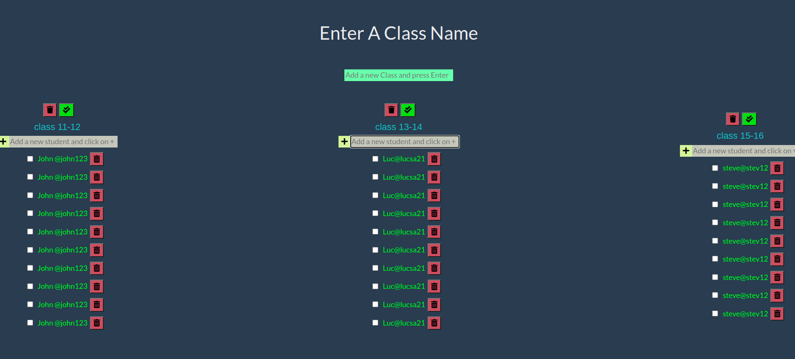

# HYF classes 


> A simple website allows the user to create and delete classes and add and delete students to each class

## Table of contents
* [General info](#general-info)
* [Screenshots](#screenshots)
* [Technologies](#technologies)
* [Setup](#setup)
* [Features](#features)
* [Status](#status)
* [Inspiration](#inspiration)
* [Contact](#contact)

## General info
A simple website allows the user to create and delete classes and add and delete students to each class, the objective is using classes to create many instances.

## Screenshots


## Technologies
* JavaScript
* HTML
* CSS
* VSC code


## Setup
open the website and create as many `classes as you want`

## Code Examples

```js
'use strict';

import { logger } from '../../lib/logger.js';

import { List } from '../classes/list.js';


/*
  a handler function that adds new lists in the list manager
  it reads in the user's title and creates a new list using the list prototype
  then renders the new list and appends it to the UI.
  users can now add and remove items from the new list
*/

export const createListHandler = (event) => {
  

  if(event.keyCode !== 13){
    return;
  }

  if (event.target.value ===  ''){
    alert(' Please type a class name and press enter');
    return;
  }

  const newClass = new List({header: event.target.value , todos: []}) ;

  const renderNewClass = newClass.render();

  document.getElementById('lists').appendChild(renderNewClass);
  event.target.value = '';

  logger.push({
    action: 'add a new class',
    event,
    newClass,
    renderNewClass,

  });
  

};
```


## Features
List of features ready and Todos for future development

* 
* 
* 

To-do list:

* 
* 

## Status
Project is: _in progress_

## Inspiration

from `Watch and Code`

## Contact
By [@Group2] 
