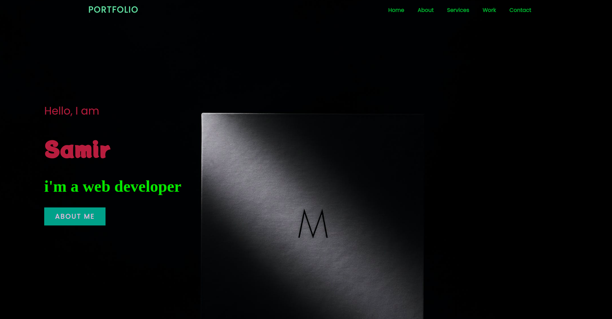

# Portfolio

> A personal portfolio to introduce the world and let them know more about me and my work. 

## Table of contents
* [General info](#general-info)
* [Screenshots](#screenshots)
* [Technologies](#technologies)
* [Setup](#setup)
* [Features](#features)
* [Status](#status)
* [Inspiration](#inspiration)
* [Contact](#contact)

## General info

A personal portfolio includes all the inforamtion about my work , contact information.


## Screenshots


## Technologies
* JavaScript
* HTML
* CSS
* VSC code


## Setup


## Code Examples

```js

'use strict';


export class Project  {
   
    constructor(id , name , link ){

        this.id = id ;
        this.name = name;
        this.link = link;                
    } 

    render(){
        const parentDiv = document.createElement('div');
        parentDiv.classList.add('parent-div');

        const parentImg = document.createElement('div');
        parentImg.classList.add('parent-img');

        // append to the parent Div

        parentDiv.appendChild(parentImg);

        const image = document.createElement('img');
        image.src = `./public/assests/${this.id}.png`;
        image.className = 'images';

        // append the img to the parent img DIV
        
        parentImg.appendChild(image);


        const projectTitle = document.createElement('h3');
        projectTitle.classList.add('project-title');
        projectTitle.innerText = `${this.name}`;

        // append to the image parent DIV

        parentImg.appendChild(projectTitle);

        const descriptionDiv = document.createElement('div');
        descriptionDiv.classList.add('description-div');
       

        const textDiv = document.createElement('div');
        textDiv.classList.add('text-div');

        // append to description DIV
        descriptionDiv.appendChild(textDiv);

        const projectLink = document.createElement('a');
        projectLink.classList.add('project-link');

        projectLink.href = `${this.link}`;

        // append to the to description DIV

        descriptionDiv.appendChild(projectLink);

         
        // append to the parent DIV
        parentDiv.appendChild(descriptionDiv);

        return parentDiv ;         

    }

}


```


## Features
List of features ready and Todos for future development

* 
* 
* 

To-do list:

* 
* 

## Status
Project is: _in progress_

## Inspiration


## Contact
By [samir] 
