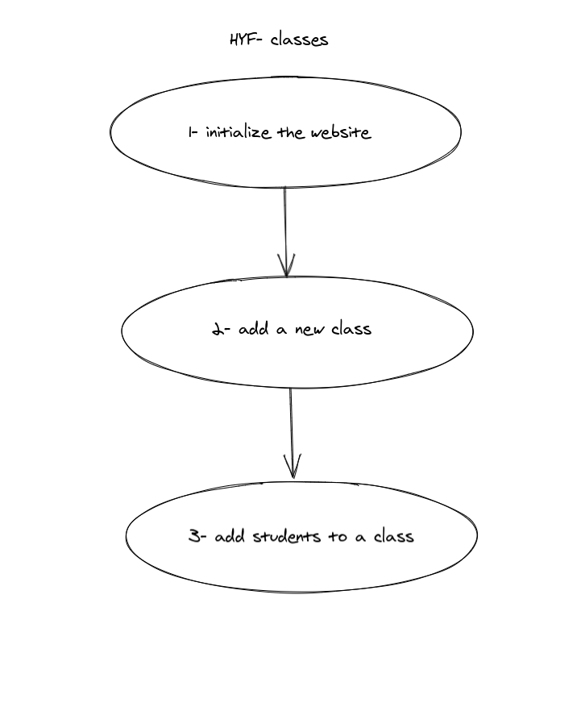
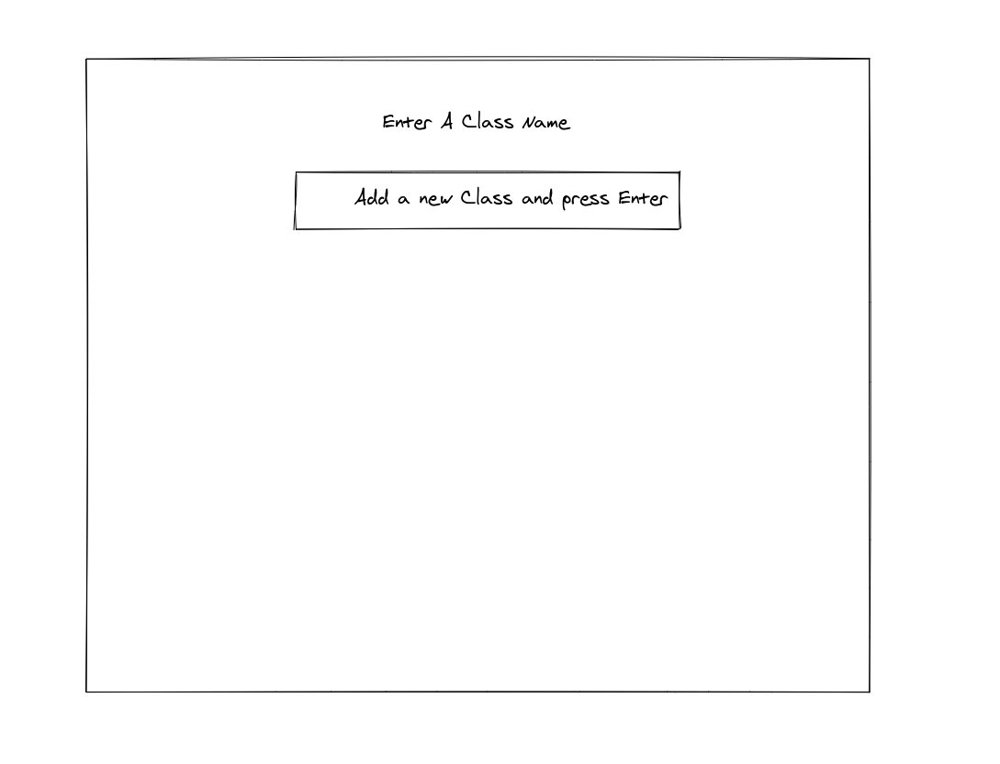

# HYF classes

A simple website allow the user to create many classes and delete them, and add students to each class and remove them 

---

## Data

> describe the data used in your project.
>
> - what properties?
> - what types?
> - what are array entries like?

 state (data) are an object with two entries , {header(title) , classes[ ] }

---

## User Story Dependencies

---

## WIREFRAME

---

## 0.Setup

- clone the template repo `starter-classes`
- turn on GitHub pages.
- write the strategy plan.
- Design a simple wireframe to set guidelines for UI/UX design.
- a simple `README.md`
---

## 1. Initialize the website

__As a user I want to see the initial page when I load the site__

- **When I open the website , I see:**
- a grey background color cover the whole `body`
- a white color title `Enter A Class name`.
- I see `input` with placeholder `Add a new class and press Enter`

### REPO

- This user story is developed on branch `1-initialize`.
- This branch is merged to `master` branch after completion.

### Task A
`index.html` :

-  this issue developed on a branch `1-initialize`
-  add a `title`
-  add  a `div` container with class `user-interface` and id `user-interface`
-  add `h1`
-  add `input` for the classes
-  add a `div` container for the classes  
### Task B
`style.css` :
-  this issue developed on a branch `1-initialize`
-  add style to the parent `div` text-align 
-  add style to the `input` background and border 
-  add style to the list `div` display, justify content and align items and wrap

## 2.class

__As a user I want to add a new class__

- **When I type the class name and press enter  , I see:**
- a new class with `title`
- a new `input` with placeholder `add a new student and press +`.
- I see `input` with placeholder `Add a new student and press Enter`
- I see two `button` on green with `double select` and one red `trash sign`.

### REPO

- This user story is developed on branch `2-class`.
- This branch is merged to `master` branch after completion.

### Task A
`list.js` :

- create a class  `List`.
- add a `state` 
- add `render` method :
   - create a new `div` which will be the parent element add class and id.
   - create a delete `button` add class and innerHtml and event listeners , - the `handler` will remove the the todo list if the user click on it .
   - create a new `h2` for the to do list, add class name and inner text
   - create add list `button` using font awesome icons, add event lister ,
   - the handler `addTodos` method will create a new todo or item .
   - create a new `input` to add the new todo or items  
   - create a new `ul` parent for the items or todos.
   - append all the created elements to the parent `div`
   - return  the parent `div`.

- add `addClasses` method :
   - take the value of `input` todo or item , add id , placeholder
   - check if the value is an empty string and if it is `alert` the user and exit.
   - assign the `input` value to `text` properties in our `state` and push it to the state.
   - call `displayClasses` method and then reassign the `input` value to `""`

- add `displayClasses` method 
   - select `ul` element we created in  `render` method and and make sure it is empty
   - from `state` get `classes` array and use `forEach` method to create and style all or `li` items .
   - create `li` element and text and id for each `li`
   - create a `checkbox` for each `li` to know if it is completed or not.
   - add event listener to `checkbox` , the handler `toggle` will check or uncheck the `li` to mark as completed or not.
   - create a delete `button` to remove `li`, and append it to the `li`
   - add event listener to delete `button` and call `deleteClasses` method.
   - append `lis` to `ul` element .

- add `check` method 
   - check if the todo is completed and if not then check it 
   - check if the todo is not completed and if not then uncheck it.

- add `deleteClasses` method:
   - remove a  todo at specific position
   - call `displayClasses` method 

- add `checkAll` method:
   - take `classes` array from state.
   - check if all `li` are completed and if not uncheck all.
   - else check all

### Task B
`style.css` :

- `div` add di_splay flex 
- `delete-btn` change background and cursor 
- `input` with  add background.
- `ul` with `id = lists` add background and remove border.

## 3. handler

### REPO

- This user story is developed on branch `3-handler`.
- This branch is merged to `master` branch after completion.

### Task A
`create-list.js` :

- import `List` class and `logger`
- create a new function `createListHandler`
- if the user didn't press enter , exit the function
- if the class title is empty alert the user and  exit.
- create a new class using `new` keyword 
- call the `render` and assign it to `renderedNewClass`
- append it to th lists `div`

## 4. listener
### REPO

- This user story is developed on branch `4-listener`.
- This branch is merged to `master` branch after completion.

### Task A
`create-list.js` :
- import the handler `createListHandler`
- add event listener to the main `input`.

## 5. init
### REPO

- This user story is developed on branch `5-init`.
- This branch is merged to `master` branch after completion.

### Task A
`index.js` :
- import the listener `create-list.js`

---
