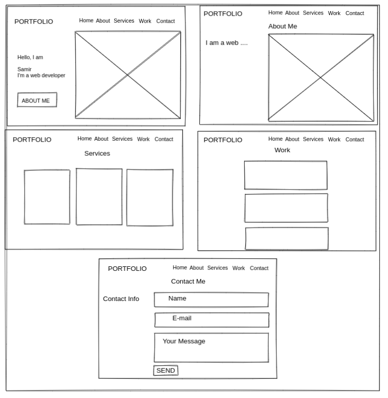

# Portfolio

---

## Data

> describe the data used in your project.
>
> - what properties?
> - what types?
> - what are array entries like?

---

## User Story Dependencies

---

## WIREFRAME

## 

## 0.Setup

- clone the template repo `starter-classes`
- turn on GitHub pages.
- write the strategy plan.
- Design a simple wireframe to set guidelines for UI/UX design.
- a simple `README.md`

---

## 1. Initialize the website

**As a user I want to see the initial page when I load the site**

- **When I open the website , I see:**

### REPO

- This user story is developed on branch `1-initialize`.
- This branch is merged to `master` branch after completion.

### Task A

`index.html` :

### Task B

---
